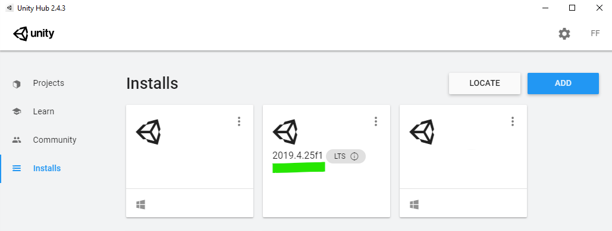

# Creating Addon Mods
Addon mods, such as parts and maps, are created in the Unity editor itself. 

The SDK includes a set of Unity tools that you can use to export your addons into a format that the game will load.

This guide takes you through the steps needed to get started for making addons and exporting addon files from your Unity project.
It assumes also that you have already completed the steps in the [Getting Started](gettingstarted.md) guide to create your mod folder and modcfg file. 


## Download the right version of Unity.
Balsa and the SDK tools currently require Unity version 2018.3.13. Unity is free for personal and hobby use.

You should make sure you are using the right version, to avoid potential issues. If you are unsure, look up your version in the Help/About Unity menu option:


The easiest way to install Unity is with the Unity Hub, [available here](https://store.unity.com/download?ref=personal)

In the Hub application, you can select different versions to install in the Installs tab.


Alternatively, standalone installers for Unity are available here: https://unity3d.com/unity/whats-new/2018.3.13


-------

## The BalsaAddons_Unity Project
The BalsaAddons_Unity project is the easiest way to get started making addon mods for Balsa.

It is a pre-configured Unity project, and it includes the Balsa Addon Tools, a set of Unity editor tools to help you generate and export addons into the game.


## BalsaAddons_Unity Project Workspace

A freshly-opened addons project will likely look like this:


In the project assets, you'll find the included example assets and a sample setup scene with some example addons ready to be exported. Use these for reference when setting up your own.


If you got to this point, you are now done setting up your Unity SDK Project, and you are ready to begin creating your own Addons. Congrats!

-----------------

# Working with Addons in Unity

It is beyond the scope of this documentation to explain in detail how to use Unity itself. There are many great resources online for learning the basics of working with Unity, so a complete tutorial here would not only be a monumental effort, it would also be quite a bit worse than what is already available. 

If you have no prior Unity experience, however, just figuring out where to start can be a bit overwhelming. Unity is an enormous piece of software, and the amount of learning material out there is equally large.

For making Balsa Addons, however, you only really need to be familiar with a few parts of Unity. Specifically, you want to focus on learning these topics to get started:

* Basic usage of the Unity Editor UI and navigating around the Scene view.
* Using the Project, Hierarchy and Inspector panels.
* Importing assets into the project, such as meshes, textures, sounds, etc.
* Working with GameObjects and creating Prefabs.
* Attaching and configuring Components on game objects
* Using the AssetBundleBrowser to configure and build assetbundles

As you become more familiar with Unity, learning these additional topics can be very helpful for making Part addons:

* Creating Particle Effects (using the Shuriken Particle system)
* Working with Unity's Mechanim Animation System

And for Maps, you could also later have a look at:

* Working with Unity Terrains. 
* Scene lighting and Lightmapping.


```
Literal Protip: If you master all of the above, you've already got a large part of the skills required to be an actual professional Technical Artist or Level Designer in game development!
```

## Creating Assets

This guide also does not cover using other software to create assets, such as 3D modeling packages or image editing software. Those are also going to be necessary to create your own addons (especially Parts), but just as with Unity, there are great resources out there on how to create 3D models and textures.

Additionally, you are free to use any software you want to create those, as long as you can export files in formats Unity can import.


## Using Unity to Export Mods

Unity is a complete game engine, and you can use it to create entire playable projects (like Balsa itself). To make Balsa Addons, however, you won't actually be hitting _play_. 

The Balsa Addons tools are 'Editor' tools, which means they run while Unity is stopped. Pressing the Play button in the Unity editor shouldn't actually do anything on a Balsa mod project. In fact, you can delete the main camera object from your unity scene completely, as the editor scene view is all you need.


This guide is only an overview, so we won't get into the specifics of how to create Parts and Maps here. For that, check out the guides on [Creating Parts](creatingparts.md) and [Creating Maps](creatingmaps.md).


### Exported Addon Files Overview

Balsa addon mods rely on Unity's Assetbundle system, which allows Unity games to import additional content at runtime. Balsa addons are exported as a set of three files:

.fob file: this is the actual assetbundle that contains your content. Normally, unity assetbundle files have no extensions, but the Balsa addons toolkit appends the .fob extension to mark them as having been processed for importing into the game.

.manifest file: the manifest file is also generated by unity, and contains metadata and additional information about the exported assets. Most importantly, however, it contains a list of all dependencies your asset may have to other assetbundle files.

.cfg file: The cfg file should be familiar to you if you have any experience making mods for KSP. This file contains configuration data for exported parts, including data for modules and other components.  
(Note that cfg files are only created for parts. Maps will only produce .fob and .manifest files.)

#### Exported Script Data

Note that one thing the exported addon files _do not_ contain is any code. The scripts that are attached to your exported part game objects are only exported in the assetbundle and cfg files as _data_. This data is then used to attach and initialize the scripts when the game loads the object. This is a crucial feature of the addons pipeline for Balsa, as the scripts the game attaches to your part are actually different from the ones the addon source project used. (See more about [creating PartModules and PartModule configurators here](partModuleConfigurators.md))

Part component scripts (the ones attached to the root object of your part prefab), are actually not exported at all in the assetbundle. These initialize completely from the cfg file data, so the exported part assets don't carry any data for those scripts.

Other components (attached to child objects of your part hierarchy, such as attachnodes, octree volumes, resource ports, fx system controllers, etc), _do_ have their data serialized in the assetbundle. Those scripts are included in the Balsa.Core assembly, which the main game also has access to, so in both projects, these components are exactly the same.


--------

# The SDK Assetbundle Tools

In Unity, you will find two tools for creating addons: The PartAssetBundleTool is used to export Parts, and the BalsaAssetBundleTool is used to export Maps.

Both of them can be found under the Tools/Floating Origin Studios/ menu on the toolbar. 

## Part Assetbundle Tools
The Part tool window allows you to set up parts for exporting. It is designed to facilitate mass-exporting multiple parts at once, based on a workflow where you have all your parts set up inside a setup scene, or saved as prefabs in a folder, or both. 

The Part tool window also has options to export your parts, and also automatically generate a modcfg file, containing entries for your parts.

### The Part addon exporting pipeline
The Part addon tool export system works over three main steps: Pre-processing, Building the actual assetbundles, and a final Post-Processing step

#### Step 1. Pre-Processing:
During this step, the addon tool will create the prefabs to be exported during the assetbundle build. Your parts are already saved as prefabs, but the ones that get exported are somewhat different. The addon tools take care of maintaining these export copies for you, so you can work with just your part prefabs.

#### Step 2. Build the Assetbundles
This is the step where your addons are exported out as Assetbundles. This step is done using Unity's own AssetbundleBrowser tool, which is already set up in the included SDK unity project.

#### Step 3. Post-Processing
At this point you have exported your assetbundle files, but they are not yet ready to be loaded into the game. To finalize the exporting, you must run the post-processing step.  

During post-processing, the addon tool will update the output .manifest files for any dependencies, generate all part.cfg files for your parts and add the .fob extension to the generated assetbundle files. 


```
Protip: If you've only made changes to the inspector data of the top level part gameobject (ie, no changes to the gameobject itself or to child components), you can get away with only post-processing, or resaving the cfg file, as the inspector data is saved to the cfg, not to the asset itself.
```
-------

## The Balsa AssetBundle Tools Window
When working with Maps, you'll want to use the BalsaAssetBundleTools window for export. This window is similar to the Part Export Tools one, but it is actually far simpler.

Because Maps don't require any pre-processing and aren't stored as prefabs, most of the work required to export them is related to setting up your assetbundles to output the unity scene itself. This is mostly done using the AssetBundleBrowser window.

Once the assetbundles are exported, you only need to run the Post-processing steo in the BalsaAssetBundleTools window to make sure your map is fully ready to be loaded by the game.


---------

## Adding entries to your modcfg File

Finally, you can add entries to your modcfg data to tell the game where to find assets in your exported files. 

The entries for Parts and Maps are quite different, but you'll find good references and examples for both of them in the modcfg files contained in the Addons/basegame folder.


