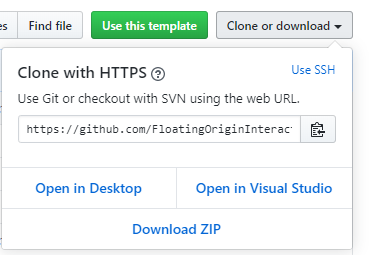
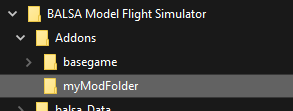

# Getting Started
This guide will take you through the steps to get started with the Addon SDK.

## SDK Installation

The Balsa SDK can be installed in several ways: 
 * If you know your way around Git, you can clone this repository to get started.  
 * You can also use this Github repository as a template to create your own copy in your own account. 
 * If you don't care about any of that and just want the SDK, click the Download Zip button in the *Clone or Download* Menu in the main page, to download the whole thing as a zip file:
 

You can clone/extract the SDK files anywhere you want, but avoid placing it inside the game's own install folder, as Steam is likely to move files around in there and potentially mess things up. 

---------

## Creating your Mod
Regardless of which mod type you are making, your first step is to create a Mod Folder and set up a modcfg file.

### Setting up your Mod Folder
The first step when starting any new Addon or Plugin mod is to create a mod folder in the game's Addon folder. This is located in `<Path to Steam Library>\steamapps\common\BALSA Model Flight Simulator\Addons` 

### .modcfg Files
As well as a mod folder, all addon mods need to have a `.modcfg` file. This file is like an index into your mod content. 

Modcfg files tell the game what content the mod contains, and where to find it. These files can also contain new definitions as well, for things like Part Resources, Career Missions, Parts List categories and filtering options, and so on.

The modcfg file then is essentially a table of contents for your mod. If it isn't listed there, the game will not load it.  

Have a look at the modcfg files in the basegame folder for reference and examples. You can have multiple modcfg files for different things in your mod folder, or you can combine it all into one file. 

You can name your modcfg file anything you want, as long as it has the .modcfg extension.

---------

## SDK Project Templates
There are several types of mod projects you can create, and some require different tools. 

#### Config Mods
Config Mods are the simplest type of mod, requiring only a text editor. Read more about [Creating Config Mods here](configmods.md).

#### Parts and Maps
Addon mods such as new parts or maps are made in Unity itself. For these, the SDK includes the BalsaAddons_Unity project. It's the fastest way to get started making addons. You can learn more about it on the [Unity Addons Project Overview](UnityAddonsOverview.md) page.

#### C# Plugins
Plugin Mods are code mods, and those are created in Visual Studio. Check out the [Visual Studio Setup Guide](vsPRojectSetup.md) to get started with a Plugin project.

#### Localizations
New Localization files can also be added as mod content. These are slightly different from other mod types, in that they don't require a modcfg entry. The game will load any .loc file located inside the Balsa/Addons folder system. .loc files are really just CSV (comma-separated values) text files, containing a table of terms and their translations to different languages. 

Have a look at [Creating Translations](creatingtranslations.md) to learn more about how to add new language content to the game.

