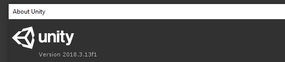
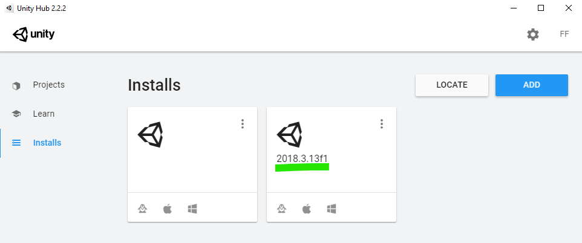

This guide will take you through the steps to get started with the Addon SDK.

## Installing Unity

Balsa, as well as many addon SDK tools, runs on the [Unity Engine](http://www.unity3d.com). Unity is free for personal and hobby use.

### Download the right version.
Balsa currently requires Unity version 2018.3.13. 

You should make sure you are using the right version, to avoid potential issues. If you are unsure, look up your version in the Help/About Unity menu option:

The easiest way to install Unity is with the Unity Hub, [available here](https://store.unity.com/download?ref=personal)

In the Hub application, you can select different versions to install in the Installs tab.

Alternatively, standalone installers for Unity are available here: https://unity3d.com/unity/whats-new/2018.3.13

## SDK Installation

The Balsa SDK can be installed in several ways: 
 * If you know your way around Git, you can clone this repository to get started.  
 * You can also use this Github repository as a template to create your own copy in your own account. 
 * If you don't care about any of that and just want the SDK, click the Download Zip button in the *Clone or Download* Menu in the main page, to download the whole thing as a zip file:
 

You can clone/extract the SDK files anywhere you want, but avoid placing it inside the game's own install folder, as Steam is likely to move files around in there and potentially mess things up. 

Once you have Unity installed, you can open the UnityAddons project included in this SDK. It's the fastest way to get started making addons. You can learn more about it on the [UnityAddons Overview](UnityAddonsOverview.md) page.

