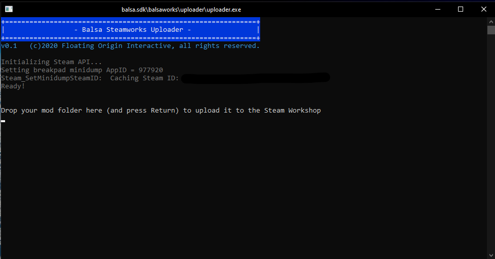

# Balsaworks Steam Uploader tool

## Overview

Balsa allows you to submit content to the Steam Workshop in various ways. 

Content generated in-game is uploaded by the game itself, using its internal steamworks uploading. This allows players to upload their craft files and missions directly.

Addon mods, however, need their own tool to be uploaded. This is done using the Balsaworks Uploader.




## Using the Uploader

You will find the uploader tool in the SDK folder, at `Balsa.SDK/balsaworks/uploader`.

### Manual usage
The uploader is a console application. It can be used manually (by double-clicking the .exe file) like any other executable. In manual mode, the program will ask you to enter the path to your mod's folder, either by typing it or (much more easily) by dragging in the folder into the window. 

When running manually, the program will also pause before it ends, allowing you to read the output directly in the console.


### CLI Usage

The uploader can also be run by commandline scripts, using the `--folderpath` argument:


```uploader.exe --folderPath "path/to/my/mod" ```

Doing so will start the uploader in CLI mode, which skips any steps where manual input is required (except in case of a first-time publish, see below). 

In CLI mode, the program will not pause. All output is sent to stdout, and the program will return non zero values if it fails for any reason (it returns zero if it finishes successfully). You can use this to integrate the uploader into an automation job.


## Uploading for the first time

To start uploading your mod, simply drag in the mod folder into the console window when prompted, or type in the path manually, then press Enter. 

The uploader will look for a file called `modexport.cfg` in the mod folder. This file is where data associated with the mod publishing is stored.

If the modexport file is not found, the uploader will create a default one. It will then prompt you to edit it, and fill out the needed information. 

Run the uploader tool again afterwards to continue the upload process.


## Uploading mod folders

When a modexport.cfg file is present in the mod folder, the uploader will use the data in the file for your mod submission. 

If the data is ok, it will then contact Steam's workshop server and begin the upload. 

Once uploading completes, Steam returns an ID number that is unique to your mod submission. 

The uploader then writes that value back on to the modexport.cfg file. Do not change the ID manually, as that will disconnect your mod from the published item.

Similarly, if you delete the modexport.cfg file, the uploader will treat it as a first-time upload the next time it runs. 


## After Uploading

Once the uploader finishes, it will automatically open your mod's workshop page in a browser. You can then continue to edit your submission using the options on the page.

Note that your mod is not published yet at this stage. Only you can see it by default. To actually publish the mod, change its visiblity to Public in the workshop page.


## Mod Installation on other Clients

When a user subscribes to an addon mod, it gets downloaded by Steam to a local folder for Balsa workshop content. This folder is not part of the game's Addons directory.
This means that unlike content mods (craft and mission files), Addon mods are not automatically loaded into the game. 

Before the addon mod can be loaded, it must first be enabled in the game's Steam Mods screen, in the settings menu. 

Enabling the mod will create a junction point (aka a symbolic link) in the game's Addons folder, connecting it to the workshop folder where the mod is. This allows the game to load workshop content without having to move or copy actual files.

These symlinks are the mechanism by which workshop mods can be enabled and disabled in game. When the mod is enabled, the symlink is created. When it is disabled, the link is deleted. This does not modify the content in the workshop folder.


## Source Mods

If your mod is locally installed in the game's Addons folder, the game will detect it as a Local mod. This prevents it from being overwritten in case you subscribe to it over the workshop.

Mind that local mods cannot be toggled on and off in the game's Steam mod manager, as the game will not modify mod folders that aren't symlinks to workshop content.


