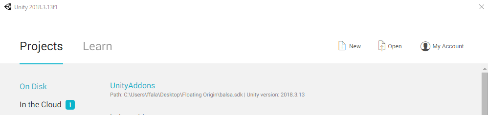

# Unity Addons Project Overview
The UnityAddons project is the easiest way to get started making addon mods for Balsa.

It includes the Balsa Addon Tools, which are a set of Unity editor tools to help you generate and export addons into the game.

## Opening the Project

To start the UnityAddons project, open Unity, and on the start page, select the UnityAddons project:

If you don't see the project on the list, add it by clicking the **Open** button on the top, and navigate to the project folder in `Balsa.SDK/UnityAddons`.

Unity will present you with a nice progress bar as it imports assets and scripts for some time, after which it will open the project.

## UnityAddons Project Workspace

